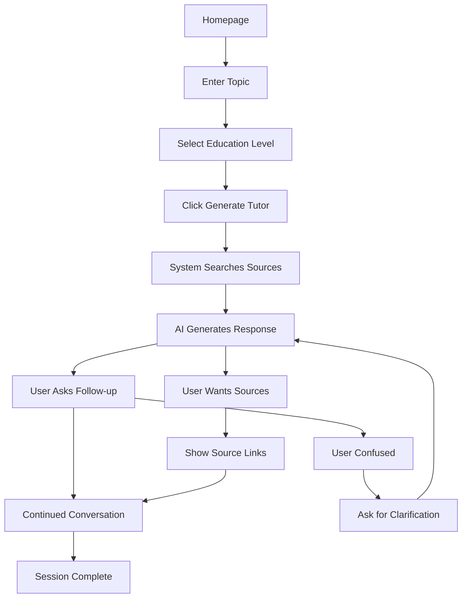
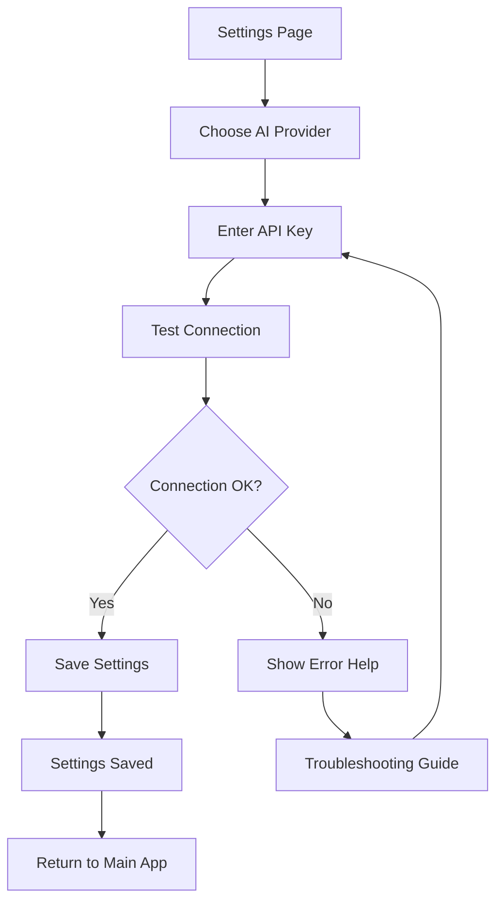
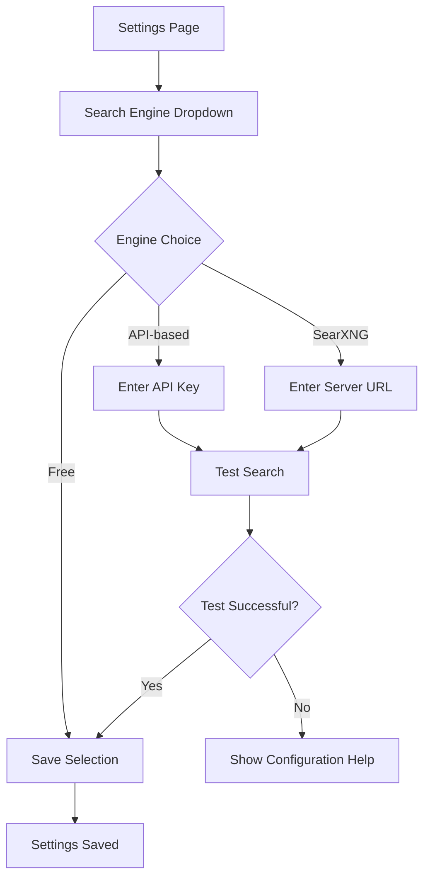

# User Experience Guide

This document outlines the user experience principles, user flows, and interaction patterns that make Study Buddy an effective and delightful learning platform.

## UX Principles

### 1. 🎯 Learning-Centered Design
**Everything serves the learning goal**
- Minimize distractions from the core learning experience
- Prioritize content readability and comprehension
- Support different learning styles and paces

### 2. 🚀 Empowerment Over Automation  
**Users maintain control and understanding**
- Transparent AI interactions - users see sources and reasoning
- Configurable behavior - adapt to user preferences
- Progressive disclosure - reveal complexity as needed

### 3. 🔒 Privacy as a Feature
**Privacy builds trust and focus**
- No external tracking or analytics
- Local data storage and processing
- Clear data handling policies

### 4. ♿ Inclusive by Design
**Accessible to all learners**
- Multiple education levels supported
- Keyboard navigation and screen reader friendly
- Clear visual hierarchy and contrast

## User Journey Map

### Discovery Phase
```
User Need → App Download → First Launch → Initial Setup
   ↓           ↓            ↓             ↓
Learn topic   Find app    See welcome   Configure AI
Research aid  on GitHub   interface     provider
```

**Key Touchpoints:**
- GitHub repository discovery
- Release download experience  
- First-time user onboarding
- Settings configuration

### Learning Phase
```
Topic Selection → Search & Research → AI Tutoring → Knowledge Testing
      ↓                ↓                ↓             ↓
  Enter topic      Find sources     Interactive      Quiz/Questions
  Set level       Parse content      chat           Self-assessment
```

**Key Touchpoints:**
- Topic input interface
- Source discovery and validation
- Conversational AI interaction
- Progress tracking and feedback

### Mastery Phase
```
Advanced Topics → Custom Configuration → Sharing Knowledge → Continued Learning
      ↓                    ↓                    ↓                ↓
Graduate level      Optimize settings    Help others      New subjects
Custom prompts      Fine-tune AI         Contribute      Deeper exploration  
```

## User Flows

### Core Flow: Getting Help with a Topic



**Pain Points Addressed:**
- **Information Overload**: Curated, level-appropriate content
- **Source Reliability**: Transparent source citation
- **Learning Pace**: Self-directed conversation flow
- **Comprehension**: Follow-up questions encouraged

### Settings Configuration Flow



**UX Considerations:**
- **Progressive Disclosure**: Advanced settings hidden initially
- **Immediate Feedback**: Connection testing with clear results
- **Error Recovery**: Helpful error messages with solutions
- **Persistent State**: Settings remembered across sessions

### Search Engine Selection Flow



## Interaction Patterns

### Conversational Interface

**Pattern**: Natural language interaction with AI tutor
**Implementation**: 
- Streaming responses for real-time feel
- Message history maintained in session
- Clear user/AI message distinction

```jsx
// Message Display Pattern
<div className="space-y-4">
  {messages.map(message => (
    <div className={`flex ${message.role === 'user' ? 'justify-end' : 'justify-start'}`}>
      <div className={`max-w-3xl rounded-lg p-4 ${
        message.role === 'user' 
          ? 'bg-blue-600 text-white' 
          : 'bg-gray-100 text-gray-900'
      }`}>
        {message.content}
      </div>
    </div>
  ))}
</div>
```

### Progressive Enhancement

**Pattern**: Core functionality works without advanced features
**Implementation**:
- Basic chat works without search integration
- Graceful degradation when services unavailable
- Optional features clearly marked

### Contextual Help

**Pattern**: Help information appears when and where needed
**Implementation**:
- Inline validation messages
- Contextual tooltips for complex settings
- Progressive disclosure of advanced options

## Information Architecture

### Primary Navigation
```
Study Buddy (Home)
├── Chat Interface (Main)
├── Settings (Configuration)
├── About (Information)
├── Legal (Compliance)
└── Docs (Help) [New]
```

### Settings Organization
```
Settings
├── AI Provider
│   ├── Service Selection
│   ├── API Configuration  
│   └── Model Selection
├── Search Engine
│   ├── Engine Selection
│   ├── API Configuration
│   └── Custom Server Setup
├── Preferences
│   ├── Default Education Level
│   ├── Interface Options
│   └── Privacy Controls
└── Advanced
    ├── Custom Endpoints
    ├── Debug Options
    └── Export/Import
```

### Documentation Structure
```
Docs (In-App)
├── Quick Start
├── Features Guide
├── Settings Help
├── Troubleshooting
└── Keyboard Shortcuts
```

## Responsive Behavior

### Mobile-First Approach

**Breakpoint Strategy:**
- Mobile (320px-640px): Single column, stacked layout
- Tablet (640px-1024px): Flexible grid, collapsible sidebar
- Desktop (1024px+): Multi-column, persistent navigation

**Touch Interactions:**
- Larger tap targets (44px minimum)
- Swipe gestures for navigation
- Pull-to-refresh where appropriate

### Cross-Platform Considerations

**Electron Desktop:**
- Native window controls integration
- Keyboard shortcuts following OS conventions
- File system integration for settings persistence

**Web Browser:**
- Progressive Web App capabilities
- Responsive design for all screen sizes
- Bookmark-friendly URLs

## Accessibility Features

### Keyboard Navigation
```
Tab Order: Logo → Main Navigation → Content → Footer
Shortcuts:
- Ctrl/Cmd + , : Settings
- Ctrl/Cmd + N : New Conversation  
- Escape : Close Modal/Cancel Action
- Enter : Submit/Confirm
- Shift + Enter : New Line in Text Area
```

### Screen Reader Support
- Semantic HTML structure
- ARIA labels for complex interactions
- Live regions for dynamic content updates
- Skip links for main content

### Visual Accessibility
- High contrast mode support
- Scalable text (respects browser zoom)
- Focus indicators on all interactive elements
- Color is never the only way to convey information

## Error Handling and Recovery

### Error State Patterns

**Connection Errors:**
```jsx
<div className="bg-red-50 border border-red-200 rounded p-4">
  <h3 className="text-red-800 font-medium">Connection Failed</h3>
  <p className="text-red-700 text-sm mt-1">
    Unable to connect to AI service. Check your API key and try again.
  </p>
  <button className="mt-2 text-red-600 underline text-sm">
    Troubleshooting Guide
  </button>
</div>
```

**Partial Failures:**
- Search fails → Continue with AI-only mode
- AI provider fails → Suggest alternative provider
- Network issues → Show offline capabilities

### Recovery Strategies
1. **Automatic Retry**: For transient network issues
2. **Graceful Degradation**: Core features remain available  
3. **Clear Error Messages**: Specific, actionable guidance
4. **Alternative Paths**: Multiple ways to accomplish goals

## Performance Expectations

### Response Time Targets
- **Page Load**: < 2 seconds
- **Search Results**: < 5 seconds
- **AI Response Start**: < 3 seconds
- **Settings Save**: < 1 second

### Loading States
```jsx
// Progressive loading pattern
{isLoading ? (
  <div className="animate-pulse space-y-2">
    <div className="h-4 bg-gray-200 rounded w-3/4"></div>
    <div className="h-4 bg-gray-200 rounded w-1/2"></div>
  </div>
) : (
  <ActualContent />
)}
```

## User Feedback Mechanisms

### Success States
- **Visual Confirmation**: Green checkmarks, success messages
- **Persistence Indicators**: "Settings saved" notifications
- **Progress Feedback**: Loading spinners, progress bars

### User Input Validation
- **Real-time Validation**: Immediate feedback on form inputs
- **Helpful Error Messages**: Specific guidance for corrections
- **Format Examples**: Show expected input format

## Personalization Features

### Adaptive Interface
- **Education Level Memory**: Remembers user's preferred level
- **Provider Preferences**: Saves AI and search configurations
- **Theme Persistence**: Maintains user interface preferences

### Learning Adaptation
- **Context Awareness**: AI remembers conversation context
- **Source Preferences**: Learns from user's source interactions
- **Difficulty Adjustment**: Suggests appropriate education levels

## Future UX Enhancements

### Planned Improvements
1. **Learning History**: Track topics explored over time
2. **Bookmark System**: Save interesting conversations
3. **Export Options**: PDF/text export of learning sessions
4. **Collaborative Features**: Share findings with others
5. **Offline Mode**: Core functionality without internet

### User Research Priorities
1. **Onboarding Flow**: First-time user experience optimization
2. **Education Level Accuracy**: Ensuring content matches expectations
3. **Search Relevance**: Quality of information sources
4. **Conversation Flow**: Natural interaction patterns

---

*This UX guide is continuously updated based on user feedback and usage patterns. For the latest features, see the [GitHub repository](https://github.com/michael-borck/study-buddy).*